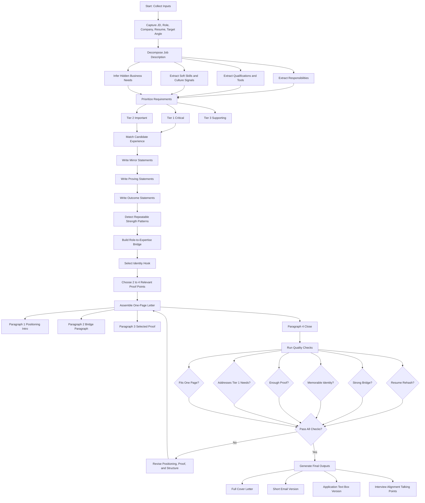

# Cover Letter Role-Alignment Engine

## Purpose
Turn a job description plus resume into a **targeted, memorable, one-page cover letter** that:

- does **not** rehash the resume
- builds the **bridge** between role needs and candidate strengths
- uses **proof** selectively
- leaves the reader with a clear **identity hook**

---

## Core principle
The cover letter is **not** a summary document.

It is a **role-alignment document**.

The resume answers:

- What has this person done?

The cover letter answers:

- Why is this person a strong fit for this specific problem?

---

## End-to-end operating framework

### Phase 1 — Intake
Collect the raw inputs required to build the letter.

#### Inputs
- Job title
- Company name
- Full job description
- Resume or proof bank
- Optional hiring manager name
- Optional tone target
- Optional company context
- Optional target angle

#### Output
A complete input packet for analysis.

#### Rules
- Do not begin writing from the JD alone if proof is available.
- Do not over-index on company praise.
- Do not assume every resume bullet is relevant.

---

### Phase 2 — JD decomposition
Break the JD into structured requirement groups.

#### Extract
- Responsibilities
- Background / qualifications
- Soft skills
- Tools / methods
- Domain signals
- Company / culture / user-impact signals

#### Also infer hidden needs
These are often more important than the literal bullet wording.

Examples:
- “Lead global deployment” may actually mean: can handle distributed dependencies and rollout risk
- “Influence stakeholders” may actually mean: can translate technical ambiguity into decision-ready alignment
- “Champion engineer experience” may actually mean: can connect internal systems to real user value

#### Output
A requirement map with explicit and implicit needs.

---

### Phase 3 — Prioritization
Rank the JD so the letter focuses on what actually matters.

#### Priority levels
- Tier 1: critical hiring drivers
- Tier 2: important support signals
- Tier 3: secondary / supporting / filler

#### Ranking criteria
A requirement moves toward Tier 1 if it is:
- repeated more than once
- tied to business outcomes
- tied to cross-functional leadership
- tied to core delivery ownership
- tied to domain credibility
- tied to scale, architecture, or decision-making

#### Output
A weighted requirement list.

#### Rule
The cover letter should mostly respond to **Tier 1** and selectively use **Tier 2**.

---

### Phase 4 — Experience matching
Map the highest-priority role needs to candidate experience.

For each top requirement, create:

#### 1. Requirement
The employer’s need.

#### 2. Mirror statement
A matched statement showing comparable experience.

#### 3. Proving statement
Specific evidence, context, tools, scope, or operating pattern.

#### 4. Outcome statement
Why it mattered; what changed or improved.

#### 5. Relevance note
Why this proof is worth using in the final letter.

#### Output
A structured alignment table.

---

### Phase 5 — Pattern detection
Move beyond bullet matching and identify the deeper pattern in the candidate’s experience.

#### Questions to answer
- What kinds of problems does this candidate repeatedly solve?
- What execution environment do they perform best in?
- What strengths show up across multiple roles?
- What is the most transferable value pattern?

#### Typical repeatable strengths
- turns ambiguity into structure
- aligns technical and operational stakeholders
- builds scalable execution systems
- reduces risk in complex environments
- translates technical work into business action
- improves visibility, accountability, and delivery discipline

#### Output
A short list of reusable strengths.

---

### Phase 6 — Bridge construction
Create the bridge between:

- the role’s real needs
- the candidate’s repeatable strengths
- the selected proof that makes the match believable

#### Bridge statement formula
**What this role requires is [need pattern]. My background is strongest in [matching strength pattern], which is why the fit is strong.**

#### Example logic
- Role needs software + systems + operations alignment
- Candidate repeatedly led technical programs + built execution frameworks + worked in semiconductor environments
- Bridge: candidate connects technical complexity to scalable operational delivery

#### Output
A set of bridge statements for use in the intro and body.

---

### Phase 7 — Identity hook selection
Choose the one sentence the reader should remember.

#### Identity hook definition
A short positioning line that answers:

**“This candidate is the one who _____.”**

#### Good identity hooks
- brings structure to complex technical execution
- bridges engineering depth with execution discipline
- connects software-enabled systems to operational reality
- reduces risk and improves momentum in cross-functional environments

#### Bad identity hooks
- hardworking team player
- strong communicator
- passionate professional
- results-driven leader

#### Output
One primary hook, one backup hook.

---

### Phase 8 — Selective proof injection
Choose only the proof points that strengthen the argument.

#### Use proof that does one or more of these
- confirms scale
- confirms domain fit
- confirms systems/process thinking
- confirms cross-functional leadership
- confirms measurable impact
- confirms decision-making credibility

#### Avoid proof that
- repeats the resume without adding relevance
- is impressive but not connected to the role
- clutters the letter with too many metrics
- shifts the letter into biography mode

#### Rule
Use **2 to 4** proof points, not 10.

---

### Phase 9 — Letter assembly
Build the one-page cover letter.

#### Recommended structure

##### Paragraph 1 — Positioning intro
Purpose:
- state the role
- state the fit theme
- state the problem you solve

##### Paragraph 2 — Bridge paragraph
Purpose:
- interpret what the role really needs
- connect that need to your experience pattern

##### Paragraph 3 — Selected proof paragraph
Purpose:
- add a few high-value proof points
- reinforce scale, credibility, and relevance

##### Paragraph 4 — Close
Purpose:
- restate fit in forward-looking terms
- invite discussion
- end cleanly

##### Word target
Roughly 250–400 words.

##### Hard rule
Every paragraph must advance the fit argument.

---

### Phase 10 — Quality control
Before finalizing, score the draft.

#### Quality checks

##### A. Resume rehash check
If the letter reads like bullet prose, it fails.

##### B. Bridge check
If it does not clearly connect role needs to candidate strengths, it fails.

##### C. Memorability check
If the reader cannot describe the candidate in one line afterward, it fails.

##### D. Proof check
If there are no specifics, it is too generic.

##### E. Relevance check
If the most important JD needs are not addressed, it fails.

##### F. Tone check
If it sounds over-eager, generic, or padded, it fails.

##### G. One-page discipline
If it tries to say everything, it fails.

#### Output
Pass / revise.

---

### Phase 11 — Output variants
Once the master letter is done, derive related outputs.

#### Variants
- full one-page cover letter
- short email version
- application text-box version
- LinkedIn outreach version
- interview answer: “Why this role?”
- interview answer: “Why should we hire you?”

---

## Decision rules

### Rule 1
Do not mirror the JD mechanically.

Use the JD to identify the hiring problem, not just the keywords.

### Rule 2
Do not make the letter a prose resume.

The resume already owns chronology and accomplishment inventory.

### Rule 3
Do not use all strong achievements.

Use only the achievements that support the role thesis.

### Rule 4
Do not lead with enthusiasm alone.

Lead with relevance.

### Rule 5
Do not describe traits without evidence.

“Strong communicator” means nothing unless shown through action or consequence.

### Rule 6
Do not overuse metrics.

Use enough proof to establish credibility, not so much that the letter becomes a fact dump.

### Rule 7
Always include a bridge sentence.

That is the sentence that connects their problem to your strength pattern.

### Rule 8
Always leave an identity hook.

The reader should remember a professional pattern, not a list.

---

## Transformation pipeline

### Raw input
JD + resume.

### Analysis layer
Requirement extraction + hidden need detection + prioritization.

### Matching layer
Requirement → mirror → proof → outcome.

### Positioning layer
Strength pattern + bridge + identity hook.

### Writing layer
Intro + bridge + proof + close.

### QA layer
Rehash check + relevance check + memorability check.

### Final output
One-page targeted letter.

---

## Worksheet template

| JD Requirement | Priority | Hidden Need | Mirror Statement | Proving Statement | Outcome Statement | Relevance to Role | Use in Letter? |
|---|---:|---|---|---|---|---|---|
| Lead global software programs | 1 | end-to-end delivery ownership | I have led complex cross-functional technical programs | aligned engineering, ops, and stakeholders across milestones | improved predictability and reduced delivery risk | core role requirement | Yes |
| Influence senior stakeholders | 1 | decision-ready alignment | I translate technical complexity for leaders | built executive reporting and cross-functional review cadence | improved alignment and faster decisions | core leadership need | Yes |
| Own scalable systems/process architecture | 1 | scale and operational structure | I built execution systems and frameworks | created dashboards, workflows, and governance mechanisms | increased visibility and accountability | strong bridge theme | Yes |

---

## Statement definitions

### Mirror statement
A matched experience claim using aligned language.

**Purpose:** show comparable experience.

### Proving statement
Specific context that makes the claim believable.

**Purpose:** show evidence.

### Outcome statement
The impact, result, or value created.

**Purpose:** show why it mattered.

### Bridge statement
The sentence that connects role need to strength pattern.

**Purpose:** show strategic fit.

### Identity hook
The memorable line that gives the candidate a clear professional shape.

**Purpose:** make the letter stick.

---

## Writing templates

### Paragraph 1 — Positioning intro
**I am interested in the [Role] because it requires [need pattern]. My background has consistently centered on [strength pattern], helping technical organizations move complex work into disciplined execution and measurable operational value.**

### Paragraph 2 — Bridge paragraph
**What stands out in this role is the need to [need 1], [need 2], and [need 3]. That closely matches the environments where I have done my best work, particularly in roles requiring [matching strength 1], [matching strength 2], and [matching strength 3].**

### Paragraph 3 — Selected proof paragraph
**Across prior roles, I have [proof point 1] and [proof point 2], while using [systems/process/analysis] to improve [result]. More importantly, that work reflects a consistent strength in [identity hook].**

### Paragraph 4 — Close
**I would welcome the opportunity to discuss how I can bring that same combination of [strength], [strength], and [strength] to your team.**

---

## Quality rubric

Score each category 1 to 5.

| Category | 1 = Weak | 3 = Adequate | 5 = Strong |
|---|---|---|---|
| Role alignment | Generic | Some fit shown | Clearly aligned to role’s real needs |
| Bridge logic | Missing | Present but thin | Strong connection between need and expertise |
| Proof quality | Vague | Some specifics | High-value, relevant proof |
| Memorability | Forgettable | Some distinctiveness | Clear identity hook remains |
| Resume duplication control | Rehash | Mixed | Selective, interpretive, non-redundant |
| One-page discipline | Bloated | Slightly crowded | Tight and focused |
| Tone | Generic / eager | Serviceable | Direct, credible, professional |

Passing target: average score **4.0+** with no score below **3** in Role alignment, Bridge logic, or Proof quality.

---

## Failure modes this framework prevents
- cover letter becomes a resume in paragraph form
- too many JD bullets get stuffed into one page
- candidate sounds generic
- achievements are listed without relevance
- letter lacks a clear thesis
- no memorable positioning remains after reading
- too much enthusiasm, not enough fit logic

---

## Mermaid flowchart

---

## Mermaid swimlane version

```mermaid
flowchart LR
    subgraph Intake
        A1[JD]
        A2[Resume]
        A3[Role Title]
        A4[Company Context]
    end

    subgraph Analysis
        B1[Extract Explicit Requirements]
        B2[Infer Hidden Needs]
        B3[Rank Critical vs Secondary]
    end

    subgraph Matching
        C1[Mirror Statement]
        C2[Proving Statement]
        C3[Outcome Statement]
    end

    subgraph Positioning
        D1[Identify Repeatable Strengths]
        D2[Build Bridge Statement]
        D3[Select Identity Hook]
    end

    subgraph Writing
        E1[Intro]
        E2[Bridge Paragraph]
        E3[Proof Paragraph]
        E4[Close]
    end

    subgraph Validation
        F1[Rehash Check]
        F2[Relevance Check]
        F3[Memorability Check]
        F4[One-Page Check]
    end

    subgraph Outputs
        G1[Cover Letter]
        G2[Email Version]
        G3[Application Version]
        G4[Interview Talking Points]
    end

    A1 --> B1
    A2 --> C1
    A3 --> B1
    A4 --> B2

    B1 --> B3
    B2 --> B3
    B3 --> C1

    C1 --> C2
    C2 --> C3
    C3 --> D1

    D1 --> D2
    D2 --> D3
    D3 --> E1

    E1 --> E2
    E2 --> E3
    E3 --> E4

    E4 --> F1
    F1 --> F2
    F2 --> F3
    F3 --> F4

    F4 --> G1
    F4 --> G2
    F4 --> G3
    F4 --> G4
```

---

## Recommended run sequence in chat
1. Paste JD.
2. Paste resume or proof bank.
3. Extract and prioritize JD.
4. Create mirror / proving / outcome table.
5. Identify repeatable strength pattern.
6. Write bridge and identity hook.
7. Assemble one-page draft.
8. Run quality check.
9. Derive short variants.

---

## Suggested future extensions
- scoring automation per section
- role-type templates by function (TPM, PM, ops, engineering, sales)
- company-fit language modules
- interview answer generator based on same proof set
- resume-to-cover-letter mapping assistant
